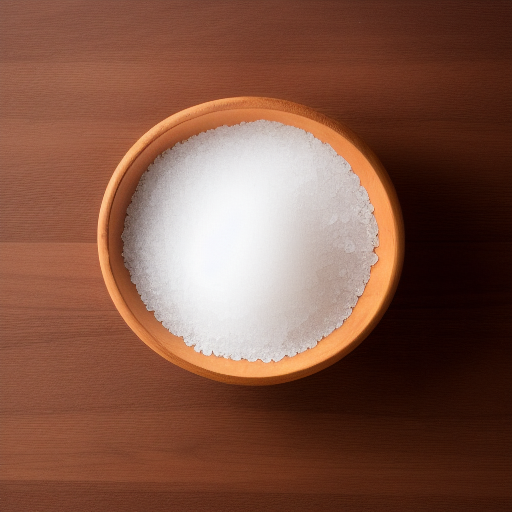
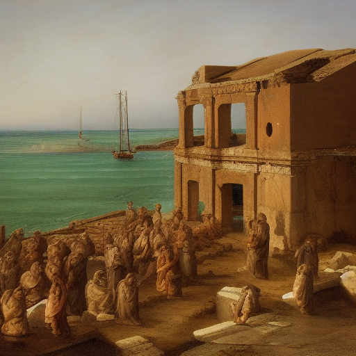
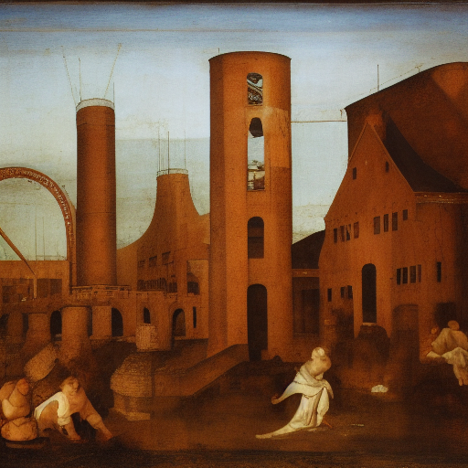
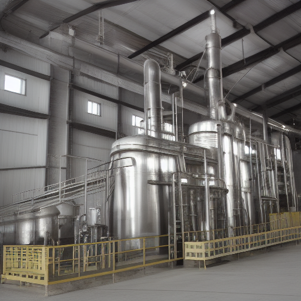
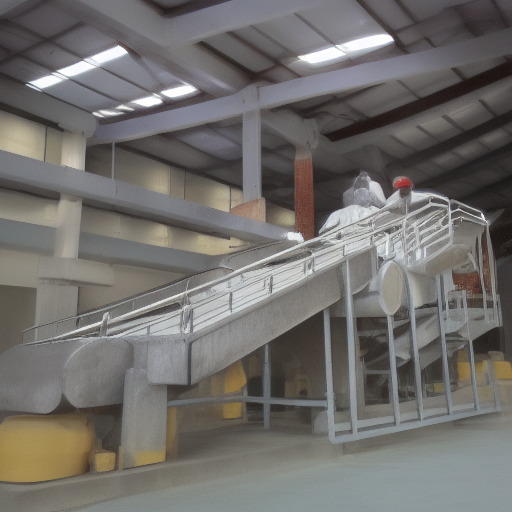

# Le sel (NaCl) à travers des âges

---

Le sel est un composant essentiel de la vie sur terre et a été utilisé depuis des milliers d'années. Il a été utilisé pour la conservation des aliments, comme médicament, et aussi comme moyen de paiement. Dans cette présentation, nous allons explorer l'histoire et l'utilisation du sel à travers les âges et voir comment il s'est adapté et a évolué. 

---

## Antiquité

Le sel était très important dans l'Antiquité. Les Romains payaient leurs soldats en sel, ce qui leur a donné le surnom de « sel ». Les anciens Égyptiens l'utilisaient pour conserver les aliments et le sel est même mentionné dans la Bible. 

---

## Moyen Âge

Au Moyen Âge, le sel était considéré comme très précieux et était très cher. Il était utilisé pour la conservation des aliments et comme moyen de paiement. Les villes qui produisaient du sel ont prospéré et ont été fondées pour en profiter. 

---

## Renaissance

Au cours de la Renaissance, le sel a continué à être utilisé pour conserver les aliments et comme moyen de paiement. Cependant, il a également été utilisé pour des applications médicales et comme source de minéraux pour le bétail. 

---

## Âge Industriel

Avec l'avènement de l'âge industriel, la production de sel a été grandement améliorée et simplifiée. Des usines ont été construites et la production de sel a été industrialisée. Cela a permis une production en masse et un coût moins élevé. 

---

## À l'ère moderne

À l'ère moderne, le sel est toujours important pour la conservation des aliments et pour d'autres usages. Cependant, il a également été utilisé pour des applications médicales et des usages industriels. Le sel est également utilisé pour le traitement des eaux usées et le nettoyage des surfaces. 

---

## Conclusion

Le sel est un composant essentiel de la vie sur terre et a été utilisé depuis des milliers d'années. Il a été utilisé pour la conservation des aliments, comme médicament, et aussi comme moyen de paiement. Au cours des siècles, le sel a évolué et s'est adapté à de nouvelles utilisations à mesure que la technologie et la science progressaient. Il est maintenant utilisé pour de nombreux usages industriels, médicaux et domestiques.